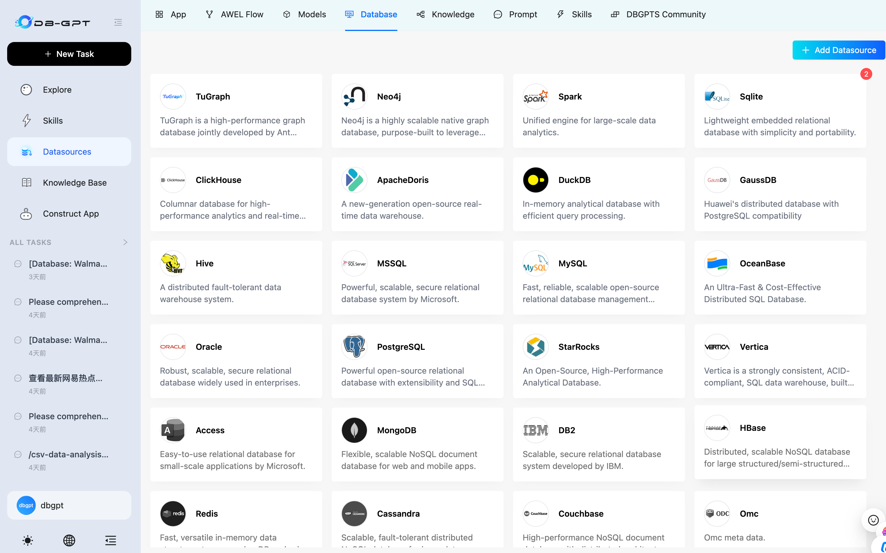

# DataSage: Open-Source Agentic AI Data Assistant

## What is DataSage?

DataSage is an open-source **agentic AI data assistant** for the next generation of **AI + Data** products.

It helps users and teams:
- connect to **databases, CSV / Excel files, warehouses, and knowledge bases**
- ask questions in natural language and let AI **write SQL autonomously**
- run **Python- and code-driven analysis** workflows
- load and execute reusable **skills** for domain-specific tasks
- generate **charts, dashboards, HTML reports, and analysis summaries**
- execute tasks safely in **sandboxed environments**

DataSage is also a platform for building **AI-native data agents, workflows, and applications** with agents, AWEL, RAG, and multi-model support.

## Why DataSage?

### 1. Agentic data analysis
Plan tasks, break work into steps, call tools, and complete analysis workflows end to end.


### 2. Autonomous SQL + code execution
Generate SQL and code to query data, clean datasets, compute metrics, and produce outputs.


### 3. Multi-source data access
Work across structured and unstructured sources, including databases, spreadsheets, documents, and knowledge bases.



### 4. Skills-driven extensibility
Package domain knowledge, analysis methods, and execution workflows into reusable skills.


### 5. Sandboxed execution
Run code and tools in isolated environments for safer, more reliable analysis.


## What you can do with DataSage

- **Analyze CSV / Excel files** and generate visual reports
- **Connect to databases** and produce profiling reports
- Ask business questions in natural language and let AI **write SQL automatically**
- Perform **financial report analysis** with code, charts, and narrative summaries
- Create and reuse **SQL analysis skills** and domain workflows
- Combine **code, SQL, retrieval, and tools** in a single agentic workflow
- Build next-generation **AI + Data assistants** for your team or product

## Product Workflow

### Explore data
Connect files, databases, and knowledge bases in one workspace.

### Plan and execute
Let AI reason through the task, write SQL and code, and execute step by step.

### Use skills
Load reusable skills for repeatable business analysis workflows.

### Generate reports
Produce charts, dashboards, HTML reports, and decision-ready outputs.


## Quick Start

Get DataSage running in minutes with the one-line installer (macOS & Linux):

```bash
curl -fsSL https://raw.githubusercontent.com/eosphoros-ai/DB-GPT/main/scripts/install/install.sh | bash
```

Or specify a profile and API key directly:

```bash
curl -fsSL https://raw.githubusercontent.com/eosphoros-ai/DB-GPT/main/scripts/install/install.sh \
  | OPENAI_API_KEY=sk-xxx bash -s -- --profile openai
```

For Kimi 2.5 via Moonshot API:

```bash
curl -fsSL https://raw.githubusercontent.com/eosphoros-ai/DB-GPT/main/scripts/install/install.sh \
  | MOONSHOT_API_KEY=sk-xxx bash -s -- --profile kimi
```

For MiniMax via the OpenAI-compatible API:

```bash
curl -fsSL https://raw.githubusercontent.com/eosphoros-ai/DB-GPT/main/scripts/install/install.sh \
  | MINIMAX_API_KEY=sk-xxx bash -s -- --profile minimax
```

Already have a local DataSage checkout? Reuse it instead of cloning `~/.dbgpt/DB-GPT`:

```bash
OPENAI_API_KEY=sk-xxx \
  bash scripts/install/install.sh --profile openai --repo-dir "$(pwd)" --yes
```

Or reuse your local repo with Kimi 2.5:

```bash
MOONSHOT_API_KEY=sk-xxx \
  bash scripts/install/install.sh --profile kimi --repo-dir "$(pwd)" --yes
```

Or reuse your local repo with MiniMax:

```bash
MINIMAX_API_KEY=sk-xxx \
  bash scripts/install/install.sh --profile minimax --repo-dir "$(pwd)" --yes
```

After installation, start the server with the generated profile config:

```bash
cd ~/.dbgpt/DB-GPT && uv run dbgpt start webserver --profile <profile>
```

Then open [http://localhost:5670](http://localhost:5670).

> **Prefer to review the script first?**
> ```bash
> curl -fsSL https://raw.githubusercontent.com/eosphoros-ai/DB-GPT/main/scripts/install/install.sh -o install.sh
> less install.sh
> bash install.sh --profile openai
> ```

### Install via PyPI

Install DataSage from PyPI and start it with a single command — no source checkout required.

> **Prerequisites:** Python **3.10+** and [uv](https://docs.astral.sh/uv/getting-started/installation/) (recommended) or pip.

**1. Install**

```bash
# Recommended: use uv
uv pip install dbgpt-app

# Or with pip
pip install dbgpt-app
```

The default installation includes the core framework (CLI, FastAPI, Agent), OpenAI-compatible LLM support, DashScope / Tongyi support, RAG document parsing, and ChromaDB vector store.

**2. Start**

```bash
dbgpt start
```

On first run, an interactive setup wizard will guide you through choosing an LLM provider and entering your API key. Once complete, the web server starts automatically.

**3. Open the Web UI**

Visit [http://localhost:5670](http://localhost:5670) — you're all set! 🎉

### Advanced Installation


For Docker, local GPU models (vLLM, llama.cpp), or manual source-code setup, see the full docs:

- [**Install**](http://docs.dbgpt.cn/docs/installation)
  - [Docker](http://docs.dbgpt.cn/docs/installation/docker)
  - [Source Code](http://docs.dbgpt.cn/docs/installation/sourcecode)
- [**Quickstart**](http://docs.dbgpt.cn/docs/quickstart)
- [**Application**](http://docs.dbgpt.cn/docs/operation_manual)
  - [Development Guide](http://docs.dbgpt.cn/docs/cookbook/app/data_analysis_app_develop)
  - [App Usage](http://docs.dbgpt.cn/docs/application/app_usage)
  - [AWEL Flow Usage](http://docs.dbgpt.cn/docs/application/awel_flow_usage)
- [**Debugging**](http://docs.dbgpt.cn/docs/operation_manual/advanced_tutorial/debugging)
- [**Advanced Usage**](http://docs.dbgpt.cn/docs/application/advanced_tutorial/cli)
  - [SMMF](http://docs.dbgpt.cn/docs/application/advanced_tutorial/smmf)
  - [Finetune](http://docs.dbgpt.cn/docs/application/fine_tuning_manual/dbgpt_hub)
  - [AWEL](http://docs.dbgpt.cn/docs/awel/tutorial)


## Core Capabilities

### Agentic Analysis
- task planning
- step-by-step execution
- tool use
- iterative reasoning

### SQL + Code Execution
- natural language to SQL
- Python-based analysis and transformation
- metric calculation
- chart generation

### Multi-Source Data Access
- relational databases
- CSV / Excel
- documents
- knowledge bases
- mixed-source workflows

### Skills and Agents
- reusable skills
- domain workflows
- agent orchestration
- customizable execution flows

### Reporting and Decision Support
- database profiling reports
- financial analysis reports
- visual reports and dashboards
- summaries and business insights

### Safe Execution
- sandboxed code execution
- controlled tool use
- reproducible outputs and artifacts

#### Text2SQL Finetune

  |     LLM     |  Supported  | 
  |:-----------:|:-----------:|
  |    LLaMA    |      ✅     |
  |   LLaMA-2   |      ✅     | 
  |    BLOOM    |      ✅     | 
  |   BLOOMZ    |      ✅     | 
  |   Falcon    |      ✅     | 
  |  Baichuan   |      ✅     | 
  |  Baichuan2  |      ✅     | 
  |  InternLM   |      ✅     |
  |    Qwen     |      ✅     | 
  |   XVERSE    |      ✅     | 
  |  ChatGLM2   |      ✅     |

[More Information about Text2SQL finetune](https://github.com/eosphoros-ai/DB-GPT-Hub)

### Supported Models

<table>
      <thead>
        <tr>
          <th>Provider</th>
          <th>Supported</th>
          <th>Models</th>
        </tr>
      </thead>
      <tbody>
        <tr>
          <td align="center" valign="middle">DeepSeek</td>
          <td align="center" valign="middle">✅</td>
          <td>
            🔥🔥🔥  <a href="https://huggingface.co/deepseek-ai/DeepSeek-R1-0528">DeepSeek-R1-0528</a><br/>
            🔥🔥🔥  <a href="https://huggingface.co/deepseek-ai/DeepSeek-V3-0324">DeepSeek-V3-0324</a><br/>
            🔥🔥🔥  <a href="https://huggingface.co/deepseek-ai/DeepSeek-R1">DeepSeek-R1</a><br/>
            🔥🔥🔥  <a href="https://huggingface.co/deepseek-ai/DeepSeek-V3">DeepSeek-V3</a><br/>
            🔥🔥🔥  <a href="https://huggingface.co/deepseek-ai/DeepSeek-R1-Distill-Llama-70B">DeepSeek-R1-Distill-Llama-70B</a><br/>
            🔥🔥🔥  <a href="https://huggingface.co/deepseek-ai/DeepSeek-R1-Distill-Qwen-32B">DeepSeek-R1-Distill-Qwen-32B</a><br/>
            🔥🔥🔥  <a href="https://huggingface.co/deepseek-ai/DeepSeek-Coder-V2-Instruct">DeepSeek-Coder-V2-Instruct</a><br/>
          </td>
        </tr>
        <tr>
          <td align="center" valign="middle">Qwen</td>
          <td align="center" valign="middle">✅</td>
          <td>
            🔥🔥🔥  <a href="https://huggingface.co/Qwen/Qwen3-235B-A22B">Qwen3-235B-A22B</a><br/>
            🔥🔥🔥  <a href="https://huggingface.co/Qwen/Qwen3-30B-A3B">Qwen3-30B-A3B</a><br/>
            🔥🔥🔥  <a href="https://huggingface.co/Qwen/Qwen3-32B">Qwen3-32B</a><br/>
            🔥🔥🔥  <a href="https://huggingface.co/Qwen/QwQ-32B">QwQ-32B</a><br/>
            🔥🔥🔥  <a href="https://huggingface.co/Qwen/Qwen2.5-Coder-32B-Instruct">Qwen2.5-Coder-32B-Instruct</a><br/>
            🔥🔥🔥  <a href="https://huggingface.co/Qwen/Qwen2.5-Coder-14B-Instruct">Qwen2.5-Coder-14B-Instruct</a><br/>
            🔥🔥🔥  <a href="https://huggingface.co/Qwen/Qwen2.5-72B-Instruct">Qwen2.5-72B-Instruct</a><br/>
            🔥🔥🔥  <a href="https://huggingface.co/Qwen/Qwen2.5-32B-Instruct">Qwen2.5-32B-Instruct</a><br/>
          </td>
        </tr>
        <tr>
          <td align="center" valign="middle">GLM</td>
          <td align="center" valign="middle">✅</td>
          <td>
            🔥🔥🔥  <a href="https://huggingface.co/THUDM/GLM-Z1-32B-0414">GLM-Z1-32B-0414</a><br/>
            🔥🔥🔥  <a href="https://huggingface.co/THUDM/GLM-4-32B-0414">GLM-4-32B-0414</a><br/>
            🔥🔥🔥  <a href="https://huggingface.co/THUDM/glm-4-9b-chat">Glm-4-9b-chat</a>
          </td>
        </tr>
        <tr>
          <td align="center" valign="middle">Llama</td>
          <td align="center" valign="middle">✅</td>
          <td>
            🔥🔥🔥  <a href="https://huggingface.co/meta-llama/Meta-Llama-3.1-405B-Instruct">Meta-Llama-3.1-405B-Instruct</a><br/>
            🔥🔥🔥  <a href="https://huggingface.co/meta-llama/Meta-Llama-3.1-70B-Instruct">Meta-Llama-3.1-70B-Instruct</a><br/>
            🔥🔥🔥  <a href="https://huggingface.co/meta-llama/Meta-Llama-3.1-8B-Instruct">Meta-Llama-3.1-8B-Instruct</a><br/>
            🔥🔥🔥  <a href="https://huggingface.co/meta-llama/Meta-Llama-3-70B-Instruct">Meta-Llama-3-70B-Instruct</a><br/>
            🔥🔥🔥  <a href="https://huggingface.co/meta-llama/Meta-Llama-3-8B-Instruct">Meta-Llama-3-8B-Instruct</a>
          </td>
        </tr>
        <tr>
          <td align="center" valign="middle">Gemma</td>
          <td align="center" valign="middle">✅</td>
          <td>
            🔥🔥🔥  <a href="https://huggingface.co/google/gemma-2-27b-it">gemma-2-27b-it</a><br>
            🔥🔥🔥  <a href="https://huggingface.co/google/gemma-2-9b-it">gemma-2-9b-it</a><br>
            🔥🔥🔥  <a href="https://huggingface.co/google/gemma-7b-it">gemma-7b-it</a><br>
            🔥🔥🔥  <a href="https://huggingface.co/google/gemma-2b-it">gemma-2b-it</a>
          </td>
        </tr>
        <tr>
          <td align="center" valign="middle">Yi</td>
          <td align="center" valign="middle">✅</td>
          <td>
            🔥🔥🔥  <a href="https://huggingface.co/01-ai/Yi-1.5-34B-Chat">Yi-1.5-34B-Chat</a><br/>
            🔥🔥🔥  <a href="https://huggingface.co/01-ai/Yi-1.5-9B-Chat">Yi-1.5-9B-Chat</a><br/>
            🔥🔥🔥  <a href="https://huggingface.co/01-ai/Yi-1.5-6B-Chat">Yi-1.5-6B-Chat</a><br/>
            🔥🔥🔥  <a href="https://huggingface.co/01-ai/Yi-34B-Chat">Yi-34B-Chat</a>
          </td>
        </tr>
        <tr>
          <td align="center" valign="middle">Starling</td>
          <td align="center" valign="middle">✅</td>
          <td>
            🔥🔥🔥  <a href="https://huggingface.co/Nexusflow/Starling-LM-7B-beta">Starling-LM-7B-beta</a>
          </td>
        </tr>
        <tr>
          <td align="center" valign="middle">SOLAR</td>
          <td align="center" valign="middle">✅</td>
          <td>
            🔥🔥🔥  <a href="https://huggingface.co/upstage/SOLAR-10.7B-Instruct-v1.0">SOLAR-10.7B</a>
          </td>
        </tr>
        <tr>
          <td align="center" valign="middle">Mixtral</td>
          <td align="center" valign="middle">✅</td>
          <td>
            🔥🔥🔥  <a href="https://huggingface.co/mistralai/Mixtral-8x7B-Instruct-v0.1">Mixtral-8x7B</a>
          </td>
        </tr>
        <tr>
          <td align="center" valign="middle">Phi</td>
          <td align="center" valign="middle">✅</td>
          <td>
            🔥🔥🔥  <a href="https://huggingface.co/collections/microsoft/phi-3-6626e15e9585a200d2d761e3">Phi-3</a>
          </td>
        </tr>
      </tbody>
    </table>

  - [More Supported LLMs](http://docs.dbgpt.site/docs/modules/smmf)

### Privacy and Security

We protect data privacy and execution safety through private model deployment, proxy desensitization, and sandboxed execution mechanisms.

### Data Sources
- [Datasources](http://docs.dbgpt.cn/docs/modules/connections)

## Vision

We believe the future of data products goes beyond dashboards.

The next generation of **AI + Data** products will be:
- **agentic**
- **multi-source**
- **skill-driven**
- **sandboxed**
- capable of writing **SQL and code**
- able to turn analysis into **reports, decisions, and action**

DataSage aims to help developers and enterprises build that future.

## Team & Collaborators

### Team Name: **PromptPirates**

### Team Members
- **Mithilesh**
- **Dinesh Sugumar**
- **Dilli Baskaran**
- **Logesh**
- **Haritharan**

